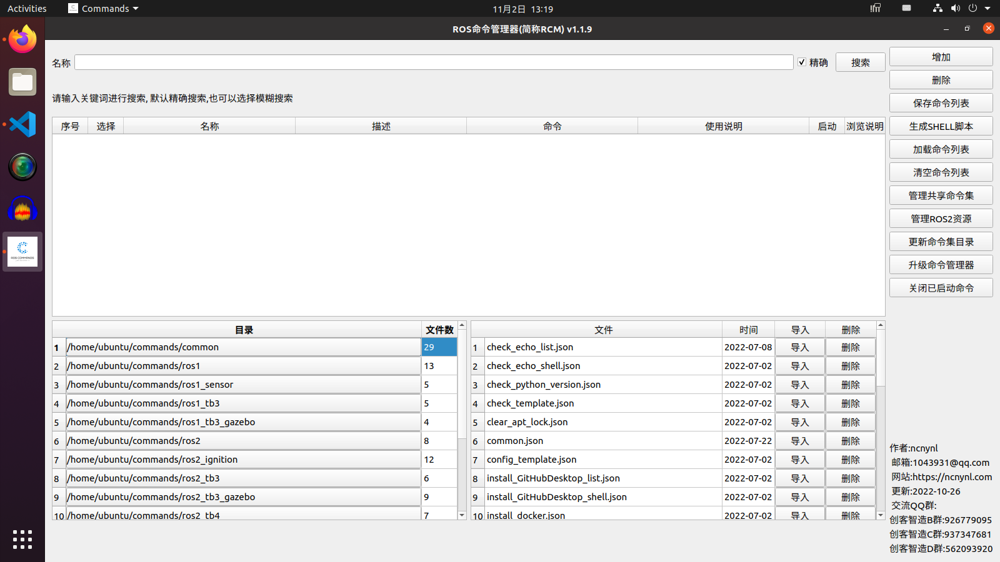

<div align=center>

#### 介绍

- ROS命令管理器，全称ROS Command Manager,简称RCM
- RCM是一款简化ROS环境配置，ROS包安装，配置和启动，从而有效提高ROS学习和使用效率的工具
- RCM能支持ubuntu20.04或以上的ubuntu系统
- RCM能支持ROS1 noetic版本的rosrun / roslaunch命令运行
- RCM能支持ROS2 galactic以上版本的ros2 run / ros2 launch命令运行
- RCM能支持ubuntu系统命令的运行
- RCM能支持APT包搜索，安装
- RCM能支持自定义安装，配置，下载，启动脚本
- RCM能支持添加ROS下载资源
- RCM能支持分享自定义脚本库
- RCM的代码开源，支持二次开发定制


- 界面：




 #### 使用说明参考

开发灵感： 

- https://www.ncnynl.com/archives/202206/5316.html

安装说明: 

- https://www.ncnynl.com/archives/202206/5317.html

使用说明: 

- https://www.ncnynl.com/archives/202206/5320.html 

命令集目录说明: 

 - https://www.ncnynl.com/archives/202206/5321.html
 - https://www.ncnynl.com/archives/202206/5323.html
 - https://www.ncnynl.com/archives/202206/5324.html


#### 软件架构

```
ubuntu 20.04 
ros2 galactic
ros1 noetic
python3.8 
pyqt5
```


#### 在线安装教程

 - 一键安装

```
rm online.sh ; wget https://gitee.com/ncnynl/commands/raw/master/online.sh ; sudo chmod +x ./online.sh; ./online.sh
```

 - 新开终端,输入commands

```
commands
```

#### 编译源码

```
cd ~/tools/commands/commands_src
```
- 编译

```
./build
```

- 文件生成在dist，可以直接执行

```
./dist/commands
```

#### 本地编译源码并进行安装

```
cd ~/tools/commands/
```

- 运行

```
./install.sh
```

#### 编辑脚本后独立安装commans_exra目录下脚本

```
cd ~/tools/commands/
```

- 运行

```
./install_extra.sh
```

#### 配置说明


 - 对于系统命令,如ls top ps等可以直接使用
 - 对于ros1或ros2命令, 需要添加ros1或ros2的路径到当前用户的~/.bashrc里
 - 添加ros1 路径，执行命令:

```
echo "source /opt/ros/noetic/setup.bash" >> ~/.bashrc
```
 - 添加ros2 路径，执行命令：

```
echo "source /opt/ros/galactic/setup.bash" >> ~/.bashrc
```

 - 对于自己的工作空间也需要添加到~/.bashrc里,要不找不到包.
 - 比如你自己的工作空间walking_ws ， 执行命令

```
echo "source ~/walking_ws/install/local_setup.bash" >> ~/.bashrc
```

