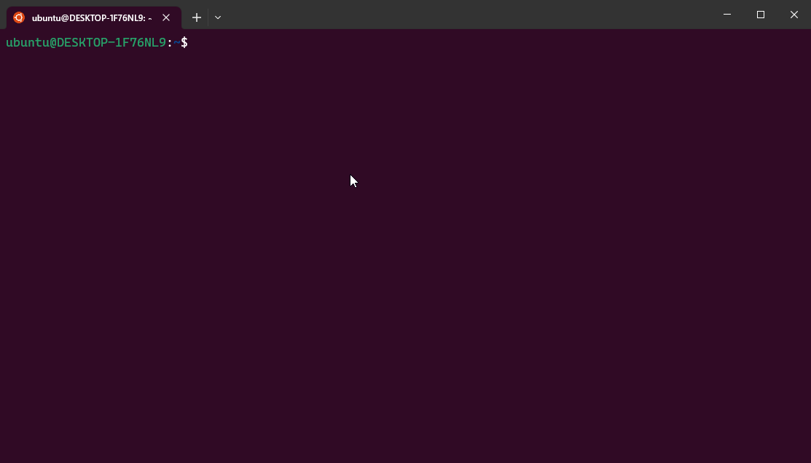

---

**RCM 解决了什么问题？** RCM初始设计用于管理ROS1/ROS2各类源码的安装脚本和通过界面方式启动脚本，经过不断扩展完善，目前已经成为Ubuntu/Linux下基于bash的shell脚本管理工具。

RCM是一款基于bash的智能化shell脚本管理和源码部署工具，可以管理，创建，修改脚本，利用公有脚本和私有脚本，安装和部署项目代码。安装后，可以将符合定义的shell脚本转换为以`RCM`为命令，脚本路径，脚本名称为子命令的系统命令。同时提供强大的Tab自动补全功能，实现脚本的快速查找。


提供三种模式运行脚本：

- 自动补全模式： `rcm <tab><tab> <tab><tab> <tab><tab>` （2.x系列以上支持）
- 搜索模式： `rcm -s <脚本名>` (1.x以上支持)
- 界面模式： `rcm-gui`或 `点击RCM（commands）图标`（1.x系列以上支持）


# 目录：

- [RCM是什么?](#RCM是什么)
- [为什么使用RCM?](#为什么使用RCM)
- [特色](#特色)
- [安装](#安装)
- [卸载](#卸载)
- [系统和依赖](#系统和依赖)
- [目录结构](#目录结构)
- [相关参考](#相关参考)
- [如何为 rcm 添加命令?](#如何为-rcm-添加命令?)
    - [创建子命令](#创建子命令)
    - [创建脚本](#创建脚本)
    - [编辑脚本](#编辑脚本)
    - [编译](#编译)
    - [执行脚本](#执行脚本)
    - [调试模式](#调试模式)
    - [帮助提示](#帮助提示)
    - [脚本内置编辑](#脚本内置编辑)
    - [脚本内置删除](#脚本内置删除)
    - [脚本搜索](#脚本搜索)
    - [RCM升级](#RCM升级)        
- [开发提示](#开发提示)
    - [环境变量](#环境变量)
    - [脚本参数](#脚本参数)
    - [命名规范](#命名规范)
    - [函数定义](#函数定义)
    - [函数引用](#函数引用)
    - [私有脚本](#私有脚本)
    - [编程语法](#编程语法)
- [桌面版开发](#桌面版开发)
- [共享代码](#共享脚本代码)
- [GIT配置](#GIT配置)
- [开源协议](#开源协议)
- [鸣谢](#鸣谢)

# 脚本应用目录：


## RCM是什么

RCM是一款基于bash的智能化shell脚本管理和源码部署工具，可以管理，创建，修改脚本，利用公有脚本和私有脚本，安装和部署项目代码。安装后，可以将符合定义的shell脚本转换为以`RCM`为命令，脚本路径，脚本名称为子命令的系统命令。同时提供强大的Tab自动补全功能，实现脚本的快速查找。

提供三种模式运行脚本：

- 自动补全模式： `rcm <tab><tab> <tab><tab> <tab><tab>` （2.x系列以上支持）
- 搜索模式： `rcm -s <脚本名>` (1.x以上支持)
- 界面模式： `rcm-gui`或 `点击RCM（commands）图标`（1.x系列以上支持）


## 为什么使用RCM

从15年开始接触到ros开始，就一直采用shell脚本的方式搭建ros环境，遇到无数的坑
相信你如果一直都使用ros，难免跟我一样会遇到如下问题：

- rosdep update 因为网站连接问题，经常不好用
- ros1/ros2的国外源经常出错或导致安装缓慢
- ubuntu系统国外源也经常出错或导致安装缓慢
- python的国外源也经常出错或导致安装缓慢
- 各种包的版本问题，各种安装异常
- ros1/ros2包源码安装，经常不成功
- 不同架构下的，安装方法也不一样

所以需要保证每次安装的统一： 统一的环境，统一配置，统一的安装方式 尽可能减少出现问题的概率。

单个版本解决方法，就是每次安装好，赶紧备份一个版本，出问题就恢复一下，继续干活，但是，每当一个新的ros版本出来，难免就要升级，上面的问题不可避免的又出来了。

我就想，如果开发一个工具，写好安装脚本，大家可以共享，很多问题，就可以避免，毕竟这个脚本是大家经过测试的。

每个人可以自己根据安装的流程，生成一个执行脚本，通过这个脚本来完成相应的工作，就可以达到统一化
如果每个人可以把自己的脚本共享出来，这个脚本就可以实现了复用，大家就可以节省很多时间。

因为维护统一脚本，出现问题，更容易解决。根据不同的需求，也可以建立不同的脚本来解决。
基于上面的需求开发了这个工具。比如我想安装ros1， 找到这个脚本，点击一键安装即可，多简单。

上述问题，适合所有采用shell脚本进行安装和维护的情况。


## 特色

- **系统调用**：以 `rcm` 为主命令，脚本存储路径、脚本名称作为子命令，进行全局调用。
- **自动补全**：支持 Tab 自动补全，加快命令的索引和调用,如：`rcm system check_ace`方式运行。
- **搜索模式**：支持采用-s参数搜索运行，如：`rcm -s <脚本名>` 方式运行。
- **直达模式**：支持采用-si参数搜索运行，如：`rcm -si <脚本名>` 方式运行。
- **桌面模式**：支持桌面运行，如：`rcm-gui` 方式启动界面。
- **帮助选项**：每个命令默认支持帮助提示，通过附加 `--help` 或 `-h` 选项，即可查看命令的功能描述。
- **debug mode**：每个命令默认支持debug mode，通过附加 `--debug` 或 `-x` 选项，即可进入命令的debug mode。
- **私有命令**：支持私有命令，相关脚本文件不会加入 git 管理。
- **ROS1/ROS2**：支持众多ROS1和ROS2相关包安装脚本。

### 自动补全模式：


### 搜索模式：


### 界面模式：


## 安装

### 桌面版/完整版： 界面需要ubuntu桌面下运行，shell在终端下运行。需要进行python代码的编译

 - 一键安装桌面版
 - 方法一：

```
curl -k http://file.ncnynl.com/rcm.sh | bash -
```

- 方法二：

```
curl -k https://gitee.com/ncnynl/commands/raw/master/online.sh | bash -
```

 - 新开终端,输入:

```
commands
```

### 命令行版： shell在终端下运行, 不需要进行python代码编译

 - 一键安装命令行版
 - 方法一：

```
curl -k http://file.ncnynl.com/rcms.sh | bash -
```

 - 方法二： 

 ```
curl -k https://gitee.com/ncnynl/commands/raw/master/online_shell.sh | bash -
```

 - 新开终端,输入:

```
rcm <tab><tab>
```


## 升级
更新 RCM，体验最新功能，命令如下：

```sh
rcm -u  或 rcm system update 
```

## 卸载
卸载 RCM，命令如下：
```sh
./tools/commands/uninstall.sh
```

## 系统和依赖

- 系统和依赖包

```sh
#系统版本,ubuntu20.04 以上版本
ubuntu 20.04 +

#针对shell版本
bash

#针对桌面版
python3.8 
pyqt5
```

- 适合ROS版本

```sh
ros2 galactic +
ros1 noetic
```

## 目录结构

- 目录树

```sh
├── CHANGELOG.rst        #日志
├── commands_completion  #自动补全相关目录
├── commands.desktop     #桌面
├── commands_docker      #docker相关目录（待完善）
├── commands_extra       #所有命令相关目录
├── commands_i18n        #多语言相关目录
├── commands.png         #LOGO
├── commands_src         #桌面版源码相关目录
├── config_git.sh        #git配置
├── desktop.sh           #桌面调用脚本
├── images               #图片相关目录
├── install_completion.sh#自动补全安装脚本
├── install_desktop.sh   #桌面安装脚本
├── install_docker.sh    #docker安装脚本（待完善）
├── install_extra.sh     #shell脚本安装脚本
├── install_i18n.sh      #多语言安装脚本
├── install.sh           #桌面版安装脚本
├── install_shell.sh     #命令行版安装脚本
├── install_simple.sh    #简化版使用脚本
├── install_src.sh       #桌面版编译脚本
├── LICENSE              #开源协议
├── logo.png             #logo
├── online_docker.sh     #docker版在线安装脚本
├── online.sh            #桌面版在线安装脚本
├── online_shell.sh      #命令行版在线安装脚本
├── README.md            #本文件
├── shell.sh             #更新所有脚本
├── sync_extra.sh        #同步应用目录的脚本到开发目录下
├── sync_gitee.sh        #不升级更新代码
├── test                 #测试相关目录
├── uninstall.sh         #卸载
└── version.txt          #版本
```

- 本程序的所有源码都安装在用户根目录`~/tools/commands`下
- 本程序的脚本分成两个目录，应用目录和开发目录，两者相互独立不影响使用和开发。
- 应用目录: 在用户根目录下的`~/commands`目录下
- 开发目录：在用户根目下的~/tools/commands/commands_extra目录下
- 开发好的脚本，通过运行./install_extra.sh同步到应用目录即可使用

 ## 相关参考

开发灵感： 

- https://www.ncnynl.com/archives/202206/5316.html

安装说明: 

- https://www.ncnynl.com/archives/202206/5317.html

使用说明: 

- https://www.ncnynl.com/archives/202206/5320.html 

命令集目录说明: 

 - https://www.ncnynl.com/archives/202206/5321.html
 - https://www.ncnynl.com/archives/202206/5323.html
 - https://www.ncnynl.com/archives/202206/5324.html


## 如何为-rcm-添加命令


## 创建子命令

RCM 管理的 Shell 脚本位于 `CS_DEV_SCRIPT` 目录下，我们可以在该目录下创建脚本或者创建子目录对脚本进行归类。为了让用户创建的子目录和脚本默认遵循 RCM 规范，RCM 通过 `rcm system create` 命令，并分别提供了相关选项来帮助用户创建子目录和 Shell 脚本。


```sh
# 创建一个名为 <dirname> 的子目录
$ rcm system create --dir <dirname> --dirdesc <description>
$ rcm system create -d <dirname> -dd <description>

# 创建一个名为 <scriptname> 的 Shell 脚本
$ rcm system create --dir <dirname> --dirdesc <description> -script <scriptname> -scriptdesc <description>
$ rcm system create -d <dirname> -dd <description> -s <scriptname> -sd <description>

# 创建一个名为 <scriptname> 的 Shell 脚本， 如果不指定目录，则默认在system目录下
$ rcm system create -s <scriptname> -sd <description>
```

## 创建目录
例如，我们希望创建一个名为 `poker` 的子目录：

```sh
$ rcm system create -d poker
#或 
$ rcm system create --dir poker --dirdesc <description>
```


进入新创建的 `poker` 目录，我们会发现该目录下默认生成一个 `.description` 隐藏文件，该文件描述了 `poker` 这个子目录分类下的脚本的主要功能。RCM 自动补全系统会读取 `.description` 中的描述信息。

## 创建脚本
在上述例子的基础上，创建一个 `ace.sh` 脚本，我们可以执行如下命令（**注：命令中无需添加 `.sh` 后缀**）：

```sh
$ rcm system create -d poker -s ace
#或
$ rcm system create --dir poker --script ace
```

如果不指定存放的目录，则增加到system目录下


此时 RCM 在 `poker` 子目录下创建了一个名为 `ace.sh` 的脚本。这个脚本是一个模板脚本，可以直接执行。
**注意：由于此时还没有对 RCM 进行编译，此时新建的子目录和脚本都还不能使用**。

## 编辑脚本
接下来，我们对 `ace.sh` 脚本进行改写，使其执行能够打印 `A, 2, 3, 4, 5, 6, 7, 9, 10, J, Q, K, Joker`。同时支持两个选项：
- `--count`（短选项：`-c`）：用户需要输入一个值，表示打印的次数。无该选项则表示打印一遍。
- `--reverse`（短选项：`-r`）：开关值选项，有该选项则表示逆序打印，无该选项则表示正序打印。

我们在 `ace.sh` 原有的模板的基础上进行修改。**注意，有几个地方需要进行修改：**
1. `function _rcm_usage_` 中，我们需要修改 `ace` 的用法、描述、选项及其描述。
2. `function rcm_execute()` 中，我们需要将获取变量 `ARGS` 时所执行的 `getopt` 命令的输入参数选项修改为我们自定义的长选项和短选项。
3. `fucntion rcm_execute()` 中，我们需要在获取选项值的 `while` 循环中，将 `case` 的值修改为我们自定义的长选项和短选项。
4. 加入脚本核心功能的代码逻辑。

最终得到如下结果：

```sh
#!/bin/bash
################################################
# Function : Check Bash Completion   
# Desc     : 用于检测自动补全功能是否完整                         
# Platform : ubuntu                                
# Version  : 1.0                               
# Date     : 2023-09-03                    
# Author   : ncnynl                             
# Contact  : 1043931@qq.com                              
# URL: https://ncnynl.com                                   
# Licnese: MIT                                 
# QQ Qun: 创客智造B群:926779095                                  
# QQ Qun: 创客智造C群:937347681                               
# QQ Qun: 创客智造D群:562093920                          
################################################
export TEXTDOMAINDIR=/usr/share/locale
export TEXTDOMAIN=commands        
echo "$(gettext "Check ace shell")"

# Usage of ace.sh
function _rcm_usage_() {
    cat << EOF
Usage:
    nox poker ace [--count <count>] [--reverse]

Description:
    Print poker numbers.

Option:
    --help|-h:                                          -- using help
    --debug|-x:                                         -- debug mode
    --reverse|-r:                                       -- whether to print in reverse order, or print in normal order without this option
    --count|-c:                                         -- the number of times to print, if there is no option, it will be printed once

EOF
}

##########################################################################################################################
#
# English note
# getopt command format description:
#   -o: means define short option
#       Example explanation: `ab:c::` defines three option types.
#           a There is no colon after a, which means that the defined a option is a switch type (true/false), and no additional parameters are required. Using the -a option means true.
#           b Followed by a colon, it means that the defined b option requires additional parameters, such as: `-b 30`
#           c Followed by a double colon, it means that the defined c option has an optional parameter, and the optional parameter must be close to the option, such as: `-carg` instead of `-c arg`
#   -long: means define long options
#       Example explanation: `a-long,b-long:,c-long::`. The meaning is basically the same as above.
#   "$@": a list representing the arguments, not including the command itself
#   -n: indicates information when an error occurs
#   --: A list representing the arguments themselves, not including the command itself
#       How to create a directory with -f
#       `mkdir -f` will fail because -f will be parsed as an option by mkdir
#       `mkdir -- -f` will execute successfully, -f will not be considered as an option
#
##########################################################################################################################
function rcm_execute() {
    local debug=0
    local reverse=false
    local count=1

    local ARGS=`getopt -o hxrc: --long help,debug,reverse,count: -n 'Error' -- "$@"`
    if [ $? != 0 ]; then
        error "Invalid option..." >&2;
        exit 1;
    fi
    # rearrange the order of parameters
    eval set -- "$ARGS"
    # after being processed by getopt, the specific options are dealt with below.
    while true ; do
        case "$1" in
            -h|--help)
                _rcm_usage_
                exit 1
                ;;
            -x|--debug)
                debug=1
                shift
                ;;
            -r|--reverse)
                reverse=true
                shift
                ;;
            -c|--count)
                count=$2
                shift 2
                ;;
            --)
                shift
                break
                ;;
            *)
                error "Internal Error!"
                exit 1
                ;;
        esac
    done

    if [[ $debug == 1 ]]; then
        set -x
    fi

    # start
    local poker=(A 2 3 4 5 6 7 8 9 10 J Q K Joker)
     
    if [[ $reverse == true ]]; then
        local length=${#poker[*]}
        local tmp=($poker)
        local i=0
        while [[ $i -lt $length ]]; do
            poker[$[$i + 1]]=$tmp[$[$length - $i]]
            i=$[i + 1]
        done
    fi

    local j=0
    while [[ $j -lt $count ]]; do
        echo ${poker[@]}
        j=$[j + 1]
    done

    if [[ $debug == 1 ]]; then
        set +x
    fi
}

# Execute current script
rcm_execute $*
```

## 编译

在创建了子目录、脚本之后，还不能直接使用，需要完成两步工作：

- 第一步：同步脚本

创建目录和脚本后，实际工作都是在开发目录中进行，可以通过安装脚本功能，把目录和脚本同步到应用目录下。执行如下命令：

```sh
cd ~/tools/commands
./install_extra.sh
或
rcm system build
```


- 第二步：重新加载环境，支持自动补全

同步脚本后，虽然可以通过系统命令的方式调用脚本，如上述例子中，可以通过 `rcm poker ace` 来调用脚本，但是却没有自动补全功能。需要通过执行 `source ~/.bashrc` 命令来使之生效，或者重启终端生效。


```sh
source ~/.bashrc
```

执行结果如下所示：


## 执行脚本
然后，我们就可以执行 `rcm poker ace` 并加上相关的选项来执行脚本。

```shell
# 顺序打印扑克牌一遍
$ rcm poker ace

# 顺序打印扑克牌两遍
$ rcm poker ace -c 2

# 逆序打印扑克牌两遍
$ rcm poker ace -c 2 -r
```


## 调试模式

通过 `rcm system create` 创建的脚本，默认都支持一个 `--debug` 和 `-x` 选项，可以将脚本的执行切换成为调试模式。调试模式能够打印出脚本所执行的每一行代码及其结果，便于开发者进行开发调试。

以 `rcm poker ace` 为例，可以采用如下方式使用调试模式执行脚本。


## 帮助提示

通过 `rcm system create` 创建的脚本，默认都支持一个 `--help` 和 `-h` 选项，可以打印出该脚本使用说明。每个脚本内部都有一个名为 `_rcm_usage_` 的方法，该方法内部定义了该脚本的使用说明。

以 `rcm poker ace` 为例，可以采用如下方式查看脚本的使用方法。


## 脚本内置编辑

通过 `rcm system create` 创建的脚本，默认都支持一个 `--edit` 和 `-e` 选项，可以打印出该脚本使用说明。每个脚本内部都有一个名为 `_rcm_edit_` 的方法，该方法内部定义了该脚本的使用说明。

以 `rcm poker ace` 为例，可以采用如下方式查看脚本的使用方法。


## 脚本内置删除

通过 `rcm system create` 创建的脚本，默认都支持一个 `--delete` 和 `-k` 选项，可以打印出该脚本使用说明。每个脚本内部都有一个名为 `_rcm_delete_` 的方法，该方法内部定义了该脚本的使用说明。

以 `rcm poker ace` 为例，可以采用如下方式查看脚本的使用方法。


## 脚本搜索

通过 `rcm system search` 搜索脚本，比如你指导某个关键词，或脚本名，但是不知道在那个分类下。可以通过搜索来找到对应的执行命令。

以 `ace` 脚本名为例，可以采用如下方式查看脚本的使用方法。


## RCM升级

通过 `rcm system update` 主动升级RCM版本，RCM会不定期更新程序和扩展更多的脚本。可以通过更新来获取更多脚本，更多新实现的功能




# 开发提示

## 环境变量

RCM 项目在应用目录下有一个cs_variables.sh文件，该文件内容设置了一系列的环境变量，便于开发者调用，如下所示：

- `CS_ROOT`：为应用目录的根目录
- `CS_DEV`：为开发目录的根目录
- `CS_DEV_SCRIPT`：为开发目录的脚本目录的根目录


## 脚本参数
RCM 为了便于补全模式使用，要求脚本的每一个参数都要有一个对应选项，从而能够充分利用自动补全功能来简化脚本的使用。

## 命名规范
目录名称和脚本名称使用 **数字、字母、`_`** 进行组合，命名应尽可能短。
如： 

```
目录：ros2_stm32
变量：cs_var="commands"
文件：cs_templates.sh
参数：--csop , --clang
```

- 尽可能保持脚本名称是唯一的

```
如：安装ros1版本ailibot的仿真文件名
install_ros1_ailibot_sim.sh 

如：安装ros2版本ailibot2的仿真文件名
install_ros2_ailibot2_sim.sh
```

## 函数定义
函数定义时建议在函数名之前加上关键字 `function`。

私有函数名建议使用 `_` 作为前缀。

一个脚本中应该只有一个公有函数cs_execute,作为入口。

## 函数引用
假如 `hello.sh` 脚本中需要引用其他脚本的功能
如1：在system目录下有`check_ace.sh`，可以使用 `rcm system check_ace` 的方式进行调用, 支持参数，并且名称唯一。
如2：在system目录下有`check_ace.sh`，可以使用 `rcm -si check_ace` 的方式进行调用, 这种方式不支持参数，并且名称唯一。

在应用目录下有一个cs_utils.sh文件定义了一系列的工具和变量。可以在脚本中引用需要的工具和变量，但是在当前脚本中要`source` 命令导入cs_utils.sh
例如： 

```
常用工具函数：source ${HOME}/commands/cs_utils.sh
常用常量变量：source ${HOME}/commands/cs_variables.sh
```

## 私有脚本

RCM 仓库中的 `.gitignore` 文件声明 git 会忽略以 `_` 为前缀的子目录或脚本。

假如我们希望 `poker` 作为私有子命令集合，我们可以将 `poker` 改为 `_poker`，那么其目录下的所有脚本都会变成你的私有脚本。同时也能够享有自动补全的功能。只不过，命令的调用也将发生变化，如：`rcm _poker ace`。


假如我们希望 `ace.sh` 作为私有脚本，我们可以将 `ace.sh` 改为 `_ace.sh`，那么脚本都会变成你的私有脚本。同时也能够享有自动补全的功能。只不过，命令的调用也将发生变化，如：`rcm poker _ace`。


## 编程语法

rcm 默认使用 bash 执行脚本，遵循bash相关语法即可，可以参考 

 - google语法规范 (https://google.github.io/styleguide/shellguide.html)
 - 参考Google的Shell风格指南 (https://zh-google-styleguide.readthedocs.io/en/latest/google-shell-styleguide/contents/)


# 桌面版开发

## 桌面版

桌面版的界面是使用python开发，并通过编译来生成对应的可执行程序。项目源码位于`~/tools/commands/commands_src`

## 本地开发编译源码

本地开发后，编译相关源码，并本地测试访问，此时还不能通过rcm-gui命令来访问

```sh
#进入源码目录
cd ~/tools/commands/commands_src

#编译
./build 

#文件生成在dist，可以直接执行
./dist/commands #执行
```

## 本地编译源码并同步到应用目录
本地开发好后，需要同步到应用目录才能真正可以外部访问。同步后即可通过rcm-gui来访问

```sh
# 进入开发目录下
cd ~/tools/commands/

#执行脚本
./install_src.sh

#访问
rcm-gui
```


## 共享脚本代码

### 参与代码开发流程
 
- fork repo / 克隆代码分支仓库

在gitee上操作，克隆代码到自己的仓库，比如自己的gitee上用户名为xxx，克隆后仓库空间为xxx/commands

```sh
git clone https://gitee.com/xxx/commands
```

- add your scripts / 增加代码到自己的分支仓库
增加相应功能后，提交自己的代码

```sh
git add .
git commit -m "desc"
```
- submit the scripts to your repo / 提交代码到自己的分支仓库

```sh
git push origin master
```

- pull request to this repo / 推送变化代码到主仓库

在gitee上操作，推送本地仓库的变化到主仓库上

- we will check your scripts / 审核相关代码

等待主仓库管理员审核代码，并合并代码到主仓库里

- all ok , merge to this repo / 合并到主仓库

代码审核后，即可合并到主仓库，功能新增成功


## 配置ROS1/ROS2说明


 - 对于系统命令,如ls top ps等可以直接使用
 - 对于ros1或ros2命令, 需要添加ros1或ros2的路径到当前用户的~/.bashrc里
 - 添加ros1 路径，执行命令:

```sh
#1.x系列
rcm -s init_ros1
#2.x系列
rcm ros_easy init_ros1
```
 - under ros_easy folder , type the ID and enter
 - 添加ros2 路径，执行命令：

```sh
# 1.x系列
rcm -s init_ros2
# 2.x系列
rcm ros_easy init_ros2
```
 - under ros_easy folder , type the ID and enter
 - 对于自己的工作空间也需要添加到~/.bashrc里,要不找不到包.
 - 比如你自己的工作空间walking_ws ， 执行命令

```sh
echo "source ~/walking_ws/install/local_setup.bash" >> ~/.bashrc
```

## GIT配置:

如果需要上传代码，本地需要配置用户和邮箱，例如： 

- 配置GIT用户和邮箱
```
git config --global user.name "ncnynl"
git config --global user.email 104391@qq.com
```

- 上传代码

```sh
# 先同步一下是否有程序更新
git pull origin master

# 增加更改的代码
git add .

# 写上备注信息
git commit -m "desc"

# 提交代码
git push origin master
```

## 开源协议

RCM is released under the MIT license.

## 鸣谢

- 自动补全部分功能借鉴和引用基于mac下使用的开源项目nox (https://github.com/baochuquan/nox)